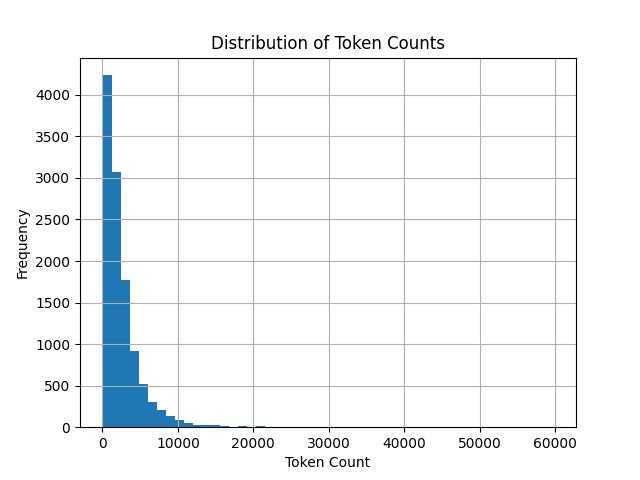

# redacted-text-utility

This repository contains codebase for redacting sensitive information from 
text documents to check how different redaction process affects the utility 
of those documents when used in the downstream tasks.

## Medical Intent Classification Dataset ([DATEXIS](https://huggingface.co/DATEXIS))

Available at:
https://huggingface.co/datasets/DATEXIS/med_intent_classification

### Preview
| text  | intents |
|-------|---------|
| you do have a little bit of periphe- peripheral neuropathy . um , there is a medication we can use if they get really bad , but you're already on so many medications . | ["Discussion", "Medication", "Reassessment"] |
| and where would you say the tingling and numbness is ? | ["Acute Symptoms"] |
| doctor: alright thanks good seeing you thanks for coming in to them | ["Chitchat"] |

### Downstream Task
Medical Intent Classification is a multi-label classification task where 
given a medical text, the goal is to predict one or more medical 
intents/labels associated with that text.

### Redaction Model
As the texts are in English, an English NER model (based on 
xlm-roberta-large) fine-tuned on OntoNotes 5.0 from HuggingFace is used for 
redaction:
https://huggingface.co/flair/ner-english-ontonotes-large

Redacted datasets can be found at [here](data/processed/DATEXIS/med_intent_classification/):
<br>
(1) train-00000-of-00001.parquet > train-00000-of-00001_ne_redacted.parquet
<br>
(2) validation-00000-of-00001.parquet > validation-00000-of-00001_ne_redacted.parquet
<br>
(3) test-00000-of-00001.parquet > test-00000-of-00001_ne_redacted.parquet

Because NER models fine-tuned on OntoNotes 5.0 detects a lot of non-private 
entities we only redact entities of type: DATE, GPE, ORG and PERSON (GPE is 
short for Geo-Political Entity which includes locations).

Moreover, we also filter out some unusual DATE and PERSON entities.
Details of the implementation can be found [here](src/utils/token_treatment_utils.py).

For transperency, we keep a separate list of excluded date entities which can be found [here](data/processed/DATEXIS/med_intent_classification/).

In the redacted datasets, 3 new columns are added in regards to 3 different redaction strategies:
<br>
(1) "text_redacted_with_semantic_label_mask"
<br>
(2) "text_redacted_with_random_mask"
<br>
(3) "text_redacted_with_generic_mask"

Not all texts from all rows contain private entities. So, in case a text does not
contain any private entities, the row in those columns are kept empty.

Example:

File: train-00000-of-00001_ne_redacted.parquet
<br>
Row Index: 2106
<br>
[text]:
```
miss edwards is here for evaluation of facial pain this is a 54 -year-old male
```
[text_redacted_with_semantic_label_mask]:
```
miss [PERSON] is here for evaluation of facial pain this is a [DATE] male
```
[text_redacted_with_random_mask]:
```
miss lhyZXSX is here for evaluation of facial pain this is a vejE4fPRUxkG male
```
[text_redacted_with_generic_mask]:
```
miss XXXX is here for evaluation of facial pain this is a XXXX male
```

Following are the statistics of (T)otal found (P)rivate (E)ntities in the raw dataset:

| Data File                         |   T-Rows |   T-Rows-PE |   T-PE |   PERSON |   DATE |   GPE |   ORG |
|:----------------------------------|---------:|------------:|-------:|---------:|-------:|------:|------:|
| train-00000-of-00001.parquet      |     3886 |         396 |    642 |      460 |    151 |    16 |    15 |
| validation-00000-of-00001.parquet |      646 |          57 |     88 |       66 |     21 |     1 |     0 |
| test-00000-of-00001.parquet       |      760 |          72 |    117 |       93 |     23 |     0 |     1 |

### Results
\* Experiments done, results will be compiled and documented soon.

## European Court of Human Rights Dataset ([AUEB-NLP](https://huggingface.co/AUEB-NLP))

Available at: https://huggingface.co/datasets/glnmario/ECHR

The dataset is an adoptation of the original ECHR dataset introduced by 
Chalkidis et al. (2019): [Neural Legal Judgment Prediction in English](https://aclanthology.org/P19-1424/)

*The original dataset download [link](https://archive.org/details/ECHR-ACL2019) 
from the paper or the [link](http://archive.org/details/ECtHR-NAACL2021/) from 
[HuggingFace](https://huggingface.co/datasets/AUEB-NLP/ecthr_cases) does not 
work anymore and hence this adoptation is used in our experiments. (last checked 
on: 9th January 2026)*

The dataset contains approximately 11.5k cases from ECHR’s public database. 
For each case, the dataset provides a list of facts (column - "text") and 
a binary label (column - "binary_judgement") indicating whether any human 
rights article or protocol of European Convention of Human Rights has been 
violated (1) or not (0).

### Preview
| itemid | text  | binary_judgement |
|--------|-------|------------------|
| 001-4817 | The applicant is a British national, born in 1945 and living in Rome. The facts of the case, as submitted by the parties, may be summarised as follows. The applicant's ... | 0 |
| 001-89307 | 7. The applicant, Mrs Danutė Balsytė-Lideikienė, is a Lithuanian national, who was born in 1947. At present she lives in Lithuania. 8. The applicant is the founder and ... | 1 |

### Downstream Task - 1: Binary Violation Prediction
Binary Violation Prediction is a binary classification task where given the 
facts of a case, the goal is to predict whether any human rights article or 
protocol of European Convention of Human Rights has been violated (1) or 
not (0).

### Preprocessing and Sample Selection
The adoptated dataset contains some cases with very large texts (more than
5.5k tokens). Such cases are excluded from the experiments to avoid
memory issues during model training. So the samples with tokens count between 
512 and 10x512 are selected for the experiments that ensures every text 
contains a few private entities to redact while also avoiding memory issues.

The following table and histogram shows the distribution of number of tokens in the text column for the ECHR dataset without any sampling -

| total_item | mean | std  | min | 25% | 50%  | 75%  | 90%   | max    |
|-----------:|-----:|-----:|----:|----:|-----:|-----:|------:|-------:|
|   11478    | 2538 | 2924 |  14 | 818 | 1737 | 3184 |  5511 |  59784 |



After sampling (selecting samples with tokens count between 512 and 10x512), the total number of samples are reduced to 8435 (~73.5%).

In the next step, with theses samples a 5-fold cross validation split is performed - to create 5 separate train(60%)/dev(20%)/test(20%) sets with rolling.

### Redaction Model
As the texts are in English, the same English NER model (based on 
xlm-roberta-large) fine-tuned on OntoNotes 5.0 earlier used for Medical 
Intent Classification dataset, is used for redaction and the private 
entities of same types: DATE, GPE, ORG and PERSON are masked or redacted.

### Fold-wise Statistics

| Stat/Label           | Fold 1                                 | Fold 2                                   | Fold 3                                   | Fold 4                                   | Fold 5                                   |
|-----------------------|------------------------------------------|------------------------------------------|------------------------------------------|------------------------------------------|------------------------------------------|
| Total Item           | Train: 5,062<br>Dev: 1,687<br>Test: 1,686         | Train: 5,061<br>Dev: 1,686<br>Test: 1,688         | Train: 5,060<br>Dev: 1,688<br>Test: 1,687         | Train: 5,061<br>Dev: 1,687<br>Test: 1,687         | Train: 5,061<br>Dev: 1,687<br>Test: 1,687         |
| Total Violation          | Train: 2,536<br>Dev: 845<br>Test: 845 | Train: 2,535<br>Dev: 845<br>Test: 846 | Train: 2,535<br>Dev: 846<br>Test: 845  | Train: 2,536<br>Dev: 845<br>Test: 845  | Train: 2,536<br>Dev: 845<br>Test: 845  |
| Total Non-violation          | Train: 2,526<br>Dev: 842<br>Test: 841 | Train: 2,526<br>Dev: 841<br>Test: 842 | Train: 2,525<br>Dev: 842<br>Test: 842  | Train: 2,525<br>Dev: 842<br>Test: 842  | Train: 2,525<br>Dev: 842<br>Test: 842  |
| Total Token          | Train: 10,407,471<br>Dev: 3,465,128<br>Test: 3,514,678 | Train: 10,357,217<br>Dev: 3,514,678<br>Test: 3,515,382 | Train: 10,404,374<br>Dev: 3,515,382<br>Test: 3,467,521  | Train: 10,495,188<br>Dev: 3,467,521<br>Test: 3,424,568  | Train: 10,497,581<br>Dev: 3,424,568<br>Test: 3,465,128  |
| Total Private Entity        | Train: 435,495<br>Dev: 144,631<br>Test: 144,816      | Train: 433,902<br>Dev: 144,816<br>Test: 146,224      | Train: 432,009<br>Dev: 146,224<br>Test: 146,709      | Train: 435,671<br>Dev: 146,709<br>Test: 142,562      | Train: 437,749<br>Dev: 142,562<br>Test: 144,631      |
| DATE        | Train: 160,873<br>Dev: 53,692<br>Test: 52,879      | Train: 161,080<br>Dev: 52,879<br>Test: 53,485      | Train: 160,251<br>Dev: 53,485<br>Test: 53,708      | Train: 160,056<br>Dev: 53,708<br>Test: 53,680      | Train: 160,072<br>Dev: 53,680<br>Test: 53,692      |
| GPE        | Train: 49,956<br>Dev: 16,410<br>Test: 16,650      | Train: 49,919<br>Dev: 16,650<br>Test: 16,447      | Train: 49,108<br>Dev: 16,447<br>Test: 17,461      | Train: 49,507<br>Dev: 17,461<br>Test: 16,048      | Train: 50,558<br>Dev: 16,048<br>Test: 16,410      |
| ORG        | Train: 160,821<br>Dev: 53,362<br>Test: 54,271      | Train: 159,558<br>Dev: 54,271<br>Test: 54,625      | Train: 159,577<br>Dev: 54,625<br>Test: 54,252      | Train: 162,258<br>Dev: 54,252<br>Test: 51,944      | Train: 163,148<br>Dev: 51,944<br>Test: 53,362      |
| PERSON        | Train: 63,845<br>Dev: 21,167<br>Test: 21,016      | Train: 63,345<br>Dev: 21,016<br>Test: 21,667      | Train: 63,073<br>Dev: 21,667<br>Test: 21,288      | Train: 63,850<br>Dev: 21,288<br>Test: 20,890      | Train: 63,971<br>Dev: 20,890<br>Test: 21,167      |

### Selected PLMs and frameworks

Three separate transformers based pre-trained language models are fine-tuned for the Text Classification task on the ECHR dataset using Flair framework (TextClassifier from flair.models and TransformerDocumentEmbeddings from flair.embeddings with allow_long_sentences=True and cls_pooling="mean"):


1. 🤗 [xlm-roberta-large](https://huggingface.co/FacebookAI/xlm-roberta-large) (<b>aka</b> xlm-roberta-large)
2. 🤗 [google/electra-large-discriminator](https://huggingface.co/google/electra-large-discriminator) (<b>aka</b> electra-large-discriminator)
3. 🤗 [google-bert/bert-large-cased](https://huggingface.co/google-bert/bert-large-cased) (<b>aka</b> bert-large-cased)

### Weights and Biases
All experiments are logged to Weights and Biases and can be found at:

https://wandb.ai/calgo-lab/redacted-text-utility/workspace

### System setup and fine-tuning parameters

The experiments were performed on a system with following configuration:

| Package     | Version     |
|-------------|------------:|
| datasets    | 4.0.0       |
| flair       | 0.15.1      |
| pyarrow     | 20.0.0      |
| tokenizers  | 0.21.4      |
| torch       | 2.7.1+cu128 |
| transformers| 4.49.0      |

and the following hyperparameters were used for fine-tuning all the three models:

| HP              |       Value |
|-----------------|------------:|
| learning_rate   | 5e-07       |
| mini_batch_size | 2           |
| max_epochs      | 25          |
| lr_scheduler    | LinearScheduler<br>  warmup_fraction: '0.1' |

### Results

The following tables show fold-wise performance, for differently redacted same 
test samples, of fine-tuned text classifiers based on different transformers 
models on the ECHR dataset for Binary Violation Prediction task:


<b>Model</b>: xlm-roberta-large <br>
<b>Metric</b>: Macro F1-score

| Redaction Strategy     |   Fold 1 |   Fold 2 |   Fold 3 |   Fold 4 |   Fold 5 |
|------------------------|---------:|---------:|---------:|---------:|---------:|
| No Redaction           |   0.8509 |   0.8711 |   0.8683 |   0.8609 |   0.8439 |
| Semantic Label Masking |   0.8548 |   0.8631 |   0.8680 |   0.8556 |   0.8581 |
| Random Masking         |   <b>0.8296</b> |   0.8622 |   0.8643 |   0.8553 |   0.8585 |
| Generic Masking        |   <b>0.8279</b> |   0.8666 |   0.8700 |   <b>0.8352</b> |   <b>0.8192</b> |
