# redacted-text-utility

This repository contains codebase for redacting sensitive information from 
text documents to check how different redaction process affects the utility 
of those documents when used for evaluation in various downstream tasks.

## Medical Intent Classification Dataset ([DATEXIS](https://huggingface.co/DATEXIS))

Available at:
https://huggingface.co/datasets/DATEXIS/med_intent_classification

### Downstream Task
Medical Intent Classification is a <b>multi-label text classification</b> task where 
given a doctor-patient conversation, the goal is to predict one or more medical 
intents/labels associated with that text.

### Preview & EDA
| text  | intents |
|-------|---------|
| you do have a little bit of periphe- peripheral neuropathy . um , there is a medication we can use if they get really bad , but you're already on so many medications . | ["Discussion", "Medication", "Reassessment"] |
| and where would you say the tingling and numbness is ? | ["Acute Symptoms"] |
| doctor: alright thanks good seeing you thanks for coming in to them | ["Chitchat"] |

<br/>

<b>List of all intent labels:</b>
|||||
|---|---|---|---|
| 1. Acute Assessment | 6. Drug History | 11. Medication | 16. Radiology Examination |
| 2. Acute Symptoms | 7. Family History | 12. Other Socials | 17. Reassessment |
| 3. Chitchat | 8. Follow-up | 13. Other Treatments | 18. Referral |
| 4. Diagnostic Testing | 9. Greetings | 14. Personal History | 19. Therapeutic History |
| 5. Discussion | 10. Lab Examination | 15. Physical Examination | 20. Vegetative History |

<br>

There are 3 separate data files [train](data/raw/DATEXIS/med_intent_classification/data/train-00000-of-00001.parquet), [validation](data/raw/DATEXIS/med_intent_classification/data/validation-00000-of-00001.parquet) and [test](data/raw/DATEXIS/med_intent_classification/data/test-00000-of-00001.parquet) splits in parquet format.
For the purpose of cross-validation setup, these files are merged together [here](data/processed/DATEXIS/med_intent_classification/mic_merged.parquet) and later will 
be split into different train/dev/test sets with rolling ignoring the original splits.

The following plots show the distribution of number of tokens in the texts and number of intents present in the merged dataset:

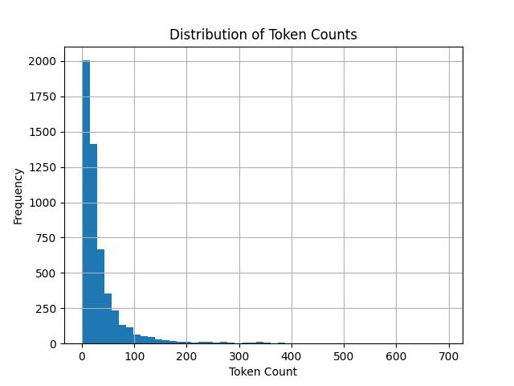&nbsp;&nbsp;
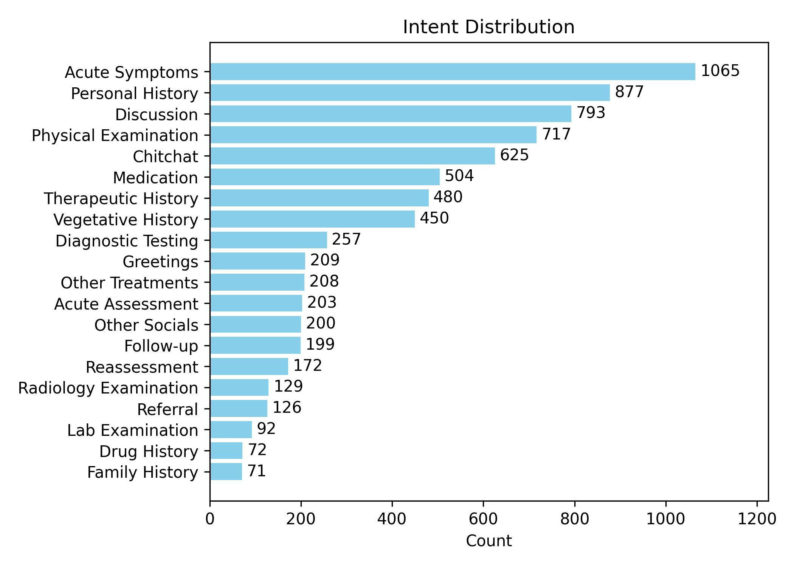&nbsp;&nbsp;

### Redaction Model, Entity Statistics and Masking Strategies
As the texts are in English, an English NER model (based on 
xlm-roberta-large) fine-tuned on OntoNotes 5.0 from HuggingFace is used for detecting entities to redact:
https://huggingface.co/flair/ner-english-ontonotes-large

Named entities dataframe: [here](data/processed/DATEXIS/med_intent_classification/mic_merged_ne.parquet)

Because NER models fine-tuned on OntoNotes 5.0 detects a lot of non-private 
entities we only redact entities of type: DATE, GPE, ORG and PERSON (GPE is 
short for Geo-Political Entity which includes locations).

Moreover, we also filter out some unusual DATE and PERSON entities.
Details of the implementation can be found [here](src/utils/token_treatment_utils.py).

Private entities dataframe: [here](data/processed/DATEXIS/med_intent_classification/mic_merged_pe.parquet)

Following are the statistics of total found (<b>P</b>)rivate (<b>E</b>)ntities in the merged raw dataset:

| Total Rows | Rows with PE | Total PE | PERSON | DATE | GPE | ORG |
|-----------:|-------------:|---------:|-------:|-----:|----:|----:|
|       5292 |          525 |      847 |    619 |  195 |  17 |  16 |

To redact the private entities from the texts, three different redaction strategies are applied:
1. Semantic Label Masking
2. Random Masking
3. Generic Masking


Example:

File: train-00000-of-00001.parquet
<br>
Row Index: 2106
<br>
Original Text:
```
miss edwards is here for evaluation of facial pain this is a 54 -year-old male
```
Text redacted with Semantic Label Masking:
```
miss [PERSON] is here for evaluation of facial pain this is a [DATE] male
```
Text redacted with Random Masking:
```
miss lhyZXSX is here for evaluation of facial pain this is a vejE4fPRUxkG male
```
Text redacted with Generic Masking:
```
miss XXXX is here for evaluation of facial pain this is a XXXX male
```

### Sample Selection and Cross-validation Setup
To align with our experimental target of checking the utility of redacted 
texts, we ignore the original train/dev/test splits. Instead, we merge all the 
samples together and then at first divide them into two groups: 
1. samples with at least one private entity
2. samples without any private entity

Then we perform 5-fold cross-validation for both splits separately while for 
train and dev sets we merge the two groups back together for each fold but for 
test samples we only include samples with at least one private entity.

This 
ensures that the test samples for each fold have at least one private entity 
to redact while also maintaining a balanced distribution of samples with and 
without private entities in the train and dev sets. For the 5-fold 
cross-validation setup with rolling the train(60%)/dev(20%)/test(20%) raitios 
are maintained.


<b>Fold-wise Statistics</b>

| Stat/Label           | Fold 1                                 | Fold 2                                   | Fold 3                                   | Fold 4                                   | Fold 5                                   |
|-----------------------|------------------------------------------|------------------------------------------|------------------------------------------|------------------------------------------|------------------------------------------|
| Total Item           | Train: 3,176<br>Dev: 1,058<br>Test: 105         | Train: 3,175<br>Dev: 1,058<br>Test: 105         | Train: 3,174<br>Dev: 1,059<br>Test: 105         | Train: 3,175<br>Dev: 1,059<br>Test: 105         | Train: 3,176<br>Dev: 1,058<br>Test: 105         |
| Intents Present      | Train: 20/20<br>Dev: 20/20<br>Test: 19/20 | Train: 20/20<br>Dev: 20/20<br>Test: 19/20 | Train: 20/20<br>Dev: 20/20<br>Test: 19/20  | Train: 20/20<br>Dev: 20/20<br>Test: 18/20  | Train: 20/20<br>Dev: 20/20<br>Test: 18/20  |
| Total Token          | Train: 113,906<br>Dev: 42,182<br>Test: 5,156 | Train: 117,290<br>Dev: 38,729<br>Test: 5,749 | Train: 118,701<br>Dev: 38,798<br>Test: 5,878  | Train: 119,709<br>Dev: 37,318<br>Test: 5,676  | Train: 114,845<br>Dev: 37,790<br>Test: 7,905  |
| Total Private Entity        | Train: 508<br>Dev: 174<br>Test: 165      | Train: 499<br>Dev: 165<br>Test: 183      | Train: 496<br>Dev: 183<br>Test: 168      | Train: 522<br>Dev: 168<br>Test: 157      | Train: 516<br>Dev: 157<br>Test: 174      |
| DATE        | Train: 118<br>Dev: 44<br>Test: 33      | Train: 116<br>Dev: 33<br>Test: 46      | Train: 111<br>Dev: 46<br>Test: 38      | Train: 123<br>Dev: 38<br>Test: 34      | Train: 117<br>Dev: 34<br>Test: 44      |
| GPE        | Train: 15<br>Dev: 2<br>Test: 0      | Train: 10<br>Dev: 0<br>Test: 7      | Train: 8<br>Dev: 7<br>Test: 2      | Train: 9<br>Dev: 2<br>Test: 6      | Train: 9<br>Dev: 6<br>Test: 2      |
| ORG        | Train: 6<br>Dev: 4<br>Test: 6      | Train: 7<br>Dev: 6<br>Test: 3      | Train: 12<br>Dev: 3<br>Test: 1      | Train: 13<br>Dev: 1<br>Test: 2      | Train: 10<br>Dev: 2<br>Test: 4      |
| PERSON        | Train: 369<br>Dev: 124<br>Test: 126      | Train: 366<br>Dev: 126<br>Test: 127      | Train: 365<br>Dev: 127<br>Test: 127      | Train: 377<br>Dev: 127<br>Test: 115      | Train: 380<br>Dev: 115<br>Test: 124      |


### Selected PLMs and Frameworks

Three separate transformers based pre-trained language models are fine-tuned for the Multi-Label Text Classification task on the Medical Intent Classification dataset using Flair framework:

1. 🤗 [xlm-roberta-large](https://huggingface.co/FacebookAI/xlm-roberta-large) (<b>aka</b> xlm-roberta-large)
2. 🤗 [google-bert/bert-large-cased](https://huggingface.co/google-bert/bert-large-cased) (<b>aka</b> bert-large-cased)
3. 🤗 [microsoft/BiomedNLP-PubMedBERT-base-uncased-abstract](https://huggingface.co/microsoft/BiomedNLP-BiomedBERT-base-uncased-abstract) (<b>aka</b> pubmedbert-base-uncased)

### System Setup and Fine-tuning Parameters

The experiments were performed on a system with following configuration:

| Package     | Version     |
|-------------|------------:|
| datasets    | 4.0.0       |
| flair       | 0.15.1      |
| pyarrow     | 20.0.0      |
| spacy       | 3.8.7       |
| tokenizers  | 0.21.4      |
| torch       | 2.7.1+cu128 |
| transformers| 4.49.0      |

(for estimating token/word counts spaCy's [en_core_web_sm](https://spacy.io/models/en#en_core_web_sm) model has been used)
>
and the following hyperparameters were used for fine-tuning all the three models:

| HP              |       Value |
|-----------------|------------:|
| learning_rate   | 5e-05       |
| mini_batch_size | 8           |
| max_epochs      | 25          |
| lr_scheduler    | LinearScheduler<br>  warmup_fraction: '0.1' |

Fine-tuning scripts: 
1. For [xlm-roberta-large & bert-large-cased](src/training_scripts/mltc/fine_tune_multi_label_text_classifier_with_transformer_model.py)
2. For [pubmedbert-base-uncased](src/training_scripts/mltc/fine_tune_multi_label_text_classifier_with_biomedbert_base.py)

Evaluation Notebook: [notebooks/evaluate_mic_mltc.ipynb](notebooks/evaluate_mic_mltc.ipynb)


Metrics Directory: [metrics/DATEXIS/med_intent_classification/mltc/](metrics/DATEXIS/med_intent_classification/mltc/)

### Weights and Biases
All experiments are logged to Weights and Biases and can be found at:

https://wandb.ai/calgo-lab/redacted-text-utility/workspace

### OLD Results

The following table shows performance (macro-average) of the fine-tuned 
PubMedBERT based text classifier on the test samples  for different redaction 
strategies:

| Redaction Strategy     | F1-score | Precision | Recall |  AUROC |
|------------------------|---------:|----------:|-------:|-------:|
| <i>No Redaction</i>    | <i>0.1928</i>   | <i>0.4049</i>    | <i>0.1434</i> | <i>0.8137</i> |
| Semantic Label Masking | 0.1901   | 0.3817    | 0.1411 | 0.8127 |
| Random Masking         | 0.1902   | 0.3808    | 0.1413 | 0.8139 |
| Generic Masking        | 0.1899   | 0.3806    | 0.1410 | 0.8129 |

### Results

<b>(*) Bold values in the tables below indicate difference of ≥ 0.05 point in 
performance metric compared to the No Redaction counterpart for that fold and 
model.
</b>

The following tables show <b>fold-wise performance</b>, for differently 
redacted same test samples, of fine-tuned multi-label text classifiers based 
on different transformers models:

<b>Model</b>: xlm-roberta-large <br>
<b>Metric</b>: Macro F1-score

| Redaction Strategy     |   Fold 1 |   Fold 2 |   Fold 3 |   Fold 4 |   Fold 5 |
|:-----------------------|---------:|---------:|---------:|---------:|---------:|
| <i>No Redaction</i>    |   <i>0.6993</i> |   <i>0.6664</i> |   <i>0.6753</i> |   <i>0.6797</i> |   <i>0.7499</i> |
| Semantic Label Masking |   <b>0.7516</b> |   0.6916 |   <b>0.7532</b> |   0.6581 |   0.7879 |
| Random Masking         |   0.7388 |   0.6780  |   <b>0.7495</b> |   0.6650  |   0.7535 |
| Generic Masking        |   <b>0.7503</b> |   0.6511 |   <b>0.7265</b> |   0.7110  |   0.7469 |

<br/>

<b>Model</b>: bert-large-cased <br>
<b>Metric</b>: Macro F1-score

| Redaction Strategy     |   Fold 1 |   Fold 2 |   Fold 3 |   Fold 4 |   Fold 5 |
|:-----------------------|---------:|---------:|---------:|---------:|---------:|
| <i>No Redaction</i>    |   <i>0.6807</i> |   <i>0.6532</i> |   <i>0.6488</i> |   <i>0.7143</i> |   <i>0.6977</i> |
| Semantic Label Masking |   0.6896 |   0.6562 |   0.6540  |   0.7301 |   0.6987 |
| Random Masking         |   0.6479 |   <b>0.5898</b> |   0.6448 |   0.7026 |   0.6993 |
| Generic Masking        |   0.6917 |   0.6822 |   0.6717 |   0.6962 |   0.7015 |

<br/>

<b>Model</b>: pubmedbert-base-uncased <br>
<b>Metric</b>: Macro F1-score

| Redaction Strategy     |   Fold 1 |   Fold 2 |   Fold 3 |   Fold 4 |   Fold 5 |
|:-----------------------|---------:|---------:|---------:|---------:|---------:|
| <i>No Redaction</i>    |   <i>0.5661</i> |   <i>0.5984</i> |   <i>0.6451</i> |   <i>0.6603</i> |   <i>0.6110</i> |
| Semantic Label Masking |   0.5758 |   0.5771 |   0.6915 |   0.6472 |   0.6404 |
| Random Masking         |   0.5765 |   0.5872 |   0.6785 |   0.6400   |   0.6042 |
| Generic Masking        |   0.5865 |   0.5870 |   <b>0.6967</b> |   0.6458 |   0.5912 |

<br/>

The following table shows <b>average performance across all folds with standard deviation</b>:

<b>Metric</b>: Macro F1-score

| Redaction Strategy     | xlm-roberta-large | bert-large-cased | pubmedbert-base-uncased |
|:-----------------------|------------------:|-----------------:|------------------------:|
| No Redaction           |       0.69 ± 0.03 |      0.68 ± 0.03 |             0.62 ± 0.03 |
| Semantic Label Masking |       0.73 ± 0.05 |      0.69 ± 0.03 |             0.63 ± 0.04 |
| Random Masking         |       0.72 ± 0.04 |      0.66 ± 0.04 |             0.62 ± 0.04 |
| Generic Masking        |       0.72 ± 0.04 |      0.69 ± 0.01 |             0.62 ± 0.04 |

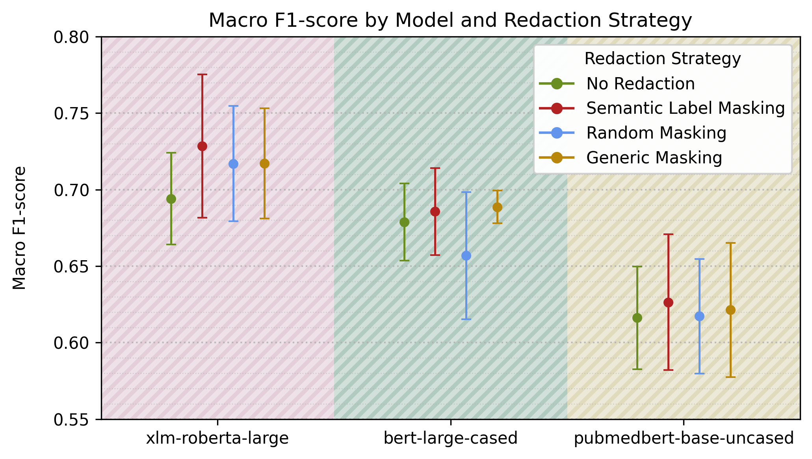

<br/>

## European Court of Human Rights Dataset ([AUEB-NLP](https://huggingface.co/AUEB-NLP))

Available at: https://huggingface.co/datasets/glnmario/ECHR

The dataset is an adoptation of the original ECHR dataset introduced by 
Chalkidis et al. (2019): [Neural Legal Judgment Prediction in English](https://aclanthology.org/P19-1424/)

*The original dataset download [link](https://archive.org/details/ECHR-ACL2019) 
from the paper or the [link](http://archive.org/details/ECtHR-NAACL2021/) from 
[HuggingFace](https://huggingface.co/datasets/AUEB-NLP/ecthr_cases) does not 
work anymore and hence this adoptation is used in our experiments. (last checked 
on: 9th January 2026)*

The dataset contains approximately 11.5k cases from ECHR’s public database. 
For each case, the dataset provides a list of facts (column - "text") and 
a binary label (column - "binary_judgement") indicating whether any human 
rights article or protocol of European Convention of Human Rights has been 
violated (1) or not (0).

### Downstream Task - 1: Binary Violation Prediction
Binary Violation Prediction is a binary classification task where given the 
facts of a case, the goal is to predict whether any human rights article or 
protocol of European Convention of Human Rights has been violated (1) or 
not (0).

### Preview & EDA
| itemid | text  | binary_judgement |
|--------|-------|------------------|
| 001-4817 | The applicant is a British national, born in 1945 and living in Rome. The facts of the case, as submitted by the parties, may be summarised as follows. The applicant's ... | 0 |
| 001-89307 | 7. The applicant, Mrs Danutė Balsytė-Lideikienė, is a Lithuanian national, who was born in 1947. At present she lives in Lithuania. 8. The applicant is the founder and ... | 1 |

The following table and histogram shows the distribution of number of tokens in the text column for the ECHR dataset without any sampling -

| total_item | mean | std  | min | 25% | 50%  | 75%  | 90%   | max    |
|-----------:|-----:|-----:|----:|----:|-----:|-----:|------:|-------:|
|   11478    | 2538 | 2924 |  14 | 818 | 1737 | 3184 |  5511 |  59784 |


### Redaction Model & Masking Strategies
As the texts are in English, the same English NER model (based on 
xlm-roberta-large) fine-tuned on OntoNotes 5.0 earlier used for Medical 
Intent Classification dataset, is used for redaction.

The private entities of same types: DATE, GPE, ORG and PERSON are masked or redacted. The same filtering of unusual DATE and PERSON entities is also applied here. And finally the same three masking strategies are used to redact the 
private entities from test samples as used for Medical Intent Classification dataset.

### Sample Selection and Cross-validation Setup
The adoptated dataset contains some cases with very large texts (more than
5.5k tokens). Such cases are excluded from the experiments to avoid
memory issues during model training. So the samples with tokens count between 
512 and 10x512 are selected for the experiments that ensures every text 
contains a few private entities to redact while also avoiding memory issues.

After sampling (selecting samples with tokens count between 512 and 10x512), the total number of samples are reduced to 8435 (~73.5%).

In the next step, with theses samples a 5-fold cross validation split is performed - to create 5 separate train(60%)/dev(20%)/test(20%) sets with rolling.

<b>Fold-wise Statistics</b>

| Stat/Label           | Fold 1                                 | Fold 2                                   | Fold 3                                   | Fold 4                                   | Fold 5                                   |
|-----------------------|------------------------------------------|------------------------------------------|------------------------------------------|------------------------------------------|------------------------------------------|
| Total Item           | Train: 5,062<br>Dev: 1,687<br>Test: 1,686         | Train: 5,061<br>Dev: 1,686<br>Test: 1,688         | Train: 5,060<br>Dev: 1,688<br>Test: 1,687         | Train: 5,061<br>Dev: 1,687<br>Test: 1,687         | Train: 5,061<br>Dev: 1,687<br>Test: 1,687         |
| Total Violation          | Train: 2,536<br>Dev: 845<br>Test: 845 | Train: 2,535<br>Dev: 845<br>Test: 846 | Train: 2,535<br>Dev: 846<br>Test: 845  | Train: 2,536<br>Dev: 845<br>Test: 845  | Train: 2,536<br>Dev: 845<br>Test: 845  |
| Total Non-violation          | Train: 2,526<br>Dev: 842<br>Test: 841 | Train: 2,526<br>Dev: 841<br>Test: 842 | Train: 2,525<br>Dev: 842<br>Test: 842  | Train: 2,525<br>Dev: 842<br>Test: 842  | Train: 2,525<br>Dev: 842<br>Test: 842  |
| Total Token          | Train: 10,407,471<br>Dev: 3,465,128<br>Test: 3,514,678 | Train: 10,357,217<br>Dev: 3,514,678<br>Test: 3,515,382 | Train: 10,404,374<br>Dev: 3,515,382<br>Test: 3,467,521  | Train: 10,495,188<br>Dev: 3,467,521<br>Test: 3,424,568  | Train: 10,497,581<br>Dev: 3,424,568<br>Test: 3,465,128  |
| Total Private Entity        | Train: 435,495<br>Dev: 144,631<br>Test: 144,816      | Train: 433,902<br>Dev: 144,816<br>Test: 146,224      | Train: 432,009<br>Dev: 146,224<br>Test: 146,709      | Train: 435,671<br>Dev: 146,709<br>Test: 142,562      | Train: 437,749<br>Dev: 142,562<br>Test: 144,631      |
| DATE        | Train: 160,873<br>Dev: 53,692<br>Test: 52,879      | Train: 161,080<br>Dev: 52,879<br>Test: 53,485      | Train: 160,251<br>Dev: 53,485<br>Test: 53,708      | Train: 160,056<br>Dev: 53,708<br>Test: 53,680      | Train: 160,072<br>Dev: 53,680<br>Test: 53,692      |
| GPE        | Train: 49,956<br>Dev: 16,410<br>Test: 16,650      | Train: 49,919<br>Dev: 16,650<br>Test: 16,447      | Train: 49,108<br>Dev: 16,447<br>Test: 17,461      | Train: 49,507<br>Dev: 17,461<br>Test: 16,048      | Train: 50,558<br>Dev: 16,048<br>Test: 16,410      |
| ORG        | Train: 160,821<br>Dev: 53,362<br>Test: 54,271      | Train: 159,558<br>Dev: 54,271<br>Test: 54,625      | Train: 159,577<br>Dev: 54,625<br>Test: 54,252      | Train: 162,258<br>Dev: 54,252<br>Test: 51,944      | Train: 163,148<br>Dev: 51,944<br>Test: 53,362      |
| PERSON        | Train: 63,845<br>Dev: 21,167<br>Test: 21,016      | Train: 63,345<br>Dev: 21,016<br>Test: 21,667      | Train: 63,073<br>Dev: 21,667<br>Test: 21,288      | Train: 63,850<br>Dev: 21,288<br>Test: 20,890      | Train: 63,971<br>Dev: 20,890<br>Test: 21,167      |

### Selected PLMs

Three separate transformers based pre-trained language models are fine-tuned for the Text Classification task on the ECHR dataset using Flair framework (TextClassifier from flair.models and TransformerDocumentEmbeddings from flair.embeddings with allow_long_sentences=True and cls_pooling="mean"):


1. 🤗 [xlm-roberta-large](https://huggingface.co/FacebookAI/xlm-roberta-large) (<b>aka</b> xlm-roberta-large)
2. 🤗 [google-bert/bert-large-cased](https://huggingface.co/google-bert/bert-large-cased) (<b>aka</b> bert-large-cased)
3. 🤗 [google/electra-large-discriminator](https://huggingface.co/google/electra-large-discriminator) (<b>aka</b> electra-large-discriminator)

### Fine-tuning Parameters

The experiments were performed on a system with similar configuration as used for Medical Intent Classification downstream model fine-tuning.

Following hyperparameters were used for fine-tuning all the three models:

| HP              |       Value |
|-----------------|------------:|
| learning_rate   | 5e-07       |
| mini_batch_size | 2           |
| max_epochs      | 25          |
| lr_scheduler    | LinearScheduler<br>  warmup_fraction: '0.1' |

Fine-tuning script: [src/training_scripts/tc/fine_tune_text_classifier_with_transformer_model.py](src/training_scripts/tc/fine_tune_text_classifier_with_transformer_model.py)


Evaluation Notebook: [notebooks/evaluate_echr_tc.ipynb](notebooks/evaluate_echr_tc.ipynb)


Metrics Directory: [metrics/glnmario/ECHR/tc/](metrics/glnmario/ECHR/tc/)

### Weights and Biases
All experiments are logged to Weights and Biases and can be found at:

https://wandb.ai/calgo-lab/redacted-text-utility/workspace

### Results

<b>(*) Bold values in the tables below indicate decrease of ≥ 0.02 point in performance metric 
compared to the No Redaction counterpart for that fold and model.</b>

The following tables show <b>fold-wise performance</b>, for differently redacted same 
test samples, of fine-tuned text classifiers based on different transformers 
models:


<b>Model</b>: xlm-roberta-large <br>
<b>Metric</b>: Macro F1-score

| Redaction Strategy     |   Fold 1 |   Fold 2 |   Fold 3 |   Fold 4 |   Fold 5 |
|------------------------|---------:|---------:|---------:|---------:|---------:|
| <i>No Redaction</i>    |   <i>0.8509</i> |   <i>0.8711</i> |   <i>0.8683</i> |   <i>0.8609</i> |   <i>0.8439</i> |
| Semantic Label Masking |   0.8548 |   0.8631 |   0.8680 |   0.8556 |   0.8581 |
| Random Masking         |   <b>0.8296</b> |   0.8622 |   0.8643 |   0.8553 |   0.8585 |
| Generic Masking        |   <b>0.8279</b> |   0.8666 |   0.8700 |   <b>0.8352</b> |   <b>0.8192</b> |

<br/>

<b>Model</b>: bert-large-cased <br>
<b>Metric</b>: Macro F1-score

| Redaction Strategy     |   Fold 1 |   Fold 2 |   Fold 3 |   Fold 4 |   Fold 5 |
|------------------------|---------:|---------:|---------:|---------:|---------:|
| <i>No Redaction</i>    |   <i>0.8337</i> |   <i>0.8645</i> |   <i>0.8682</i> |   <i>0.8563</i> |   <i>0.8409</i> |
| Semantic Label Masking |   0.8143 |   0.8563 |   <b>0.8399</b> |   0.8498 |   0.8453 |
| Random Masking         |   <b>0.7954</b> |   0.8513 |   0.8520 |   <b>0.8037</b> |   <b>0.8132</b> |
| Generic Masking        |   0.8262 |   0.8580 |   0.8531 |   0.8527 |   0.8472 |
<br/>

<b>Model</b>: electra-large-discriminator <br>
<b>Metric</b>: Macro F1-score

| Redaction Strategy     |   Fold 1 |   Fold 2 |   Fold 3 |   Fold 4 |   Fold 5 |
|------------------------|---------:|---------:|---------:|---------:|---------:|
| <i>No Redaction</i>    |   <i>0.8380</i> |   <i>0.8398</i> |   <i>0.8476</i> |   <i>0.8569</i> |   <i>0.8273</i> |
| Semantic Label Masking |   0.8188 |   <b>0.8036</b> |   <b>0.7986</b> |   0.8497 |   0.8122 |
| Random Masking         |   <b>0.8149</b> |   <b>0.8117</b> |   <b>0.8131</b> |   0.8390 |   <b>0.7984</b> |
| Generic Masking        |   <b>0.8088</b> |   <b>0.8084</b> |   0.8300 |   0.8492 |   0.8162 |

<br/>

The following table shows <b>average performance across all folds with standard deviation</b>:

<b>Metric</b>: Macro F1-score

| Redaction Strategy      | xlm-roberta-large   | bert-large-cased   | electra-large-discriminator   |
|:------------------------|--------------------:|-------------------:|------------------------------:|
| <i>No Redaction</i>     | <i>0.86 ± 0.01</i>  | <i>0.85 ± 0.01</i> | <i>0.84 ± 0.01</i>            |
| Semantic Label Masking  | 0.86 ± 0.01         | 0.84 ± 0.01        | <b>0.82 ± 0.02</b>            |
| Random Masking          | 0.85 ± 0.01         | <b>0.82 ± 0.02</b> | <b>0.82 ± 0.01</b>            |
| Generic Masking         | <b>0.84 ± 0.02</b>  | 0.85 ± 0.01        | <b>0.82 ± 0.02</b>            |

<br/>

<b>Entity-count</b> statistics in test samples for differnt folds:

|   Fold     | total_item |   mean |   std |   min |   25% |   50% |   75% |   max |
|-----------:|-----------:|-------:|------:|------:|------:|------:|------:|------:|
|          1 |       1686 |     85 |    51 |     7 |    49 |    72 |   111 |   357 |
|          2 |       1688 |     86 |    51 |     5 |    49 |    73 |   113 |   335 |
|          3 |       1687 |     86 |    52 |    13 |    48 |    74 |   115 |   383 |
|          4 |       1687 |     84 |    50 |    11 |    48 |    71 |   108 |   472 |
|          5 |       1687 |     85 |    51 |     2 |    47 |    72 |   111 |   411 |

<b>Entity-count / Token-count</b> statistics in test samples segmented by 
<b>entity count percentile ranges</b> (averaged across all folds):

|        |   total_item | mean       | std       | min        | 25%        | 50%        | 75%        | max        |
|-------:|-------------:|-----------:|----------:|-----------:|-----------:|-----------:|-----------:|-----------:|
| 0-100  |         1687 | 86 / 2061  | 51 / 1169 | 8 / 514    | 48 / 1095  | 72 / 1812  | 112 / 2803 | 392 / 5103 |
| 0-25   |          433 | 36 / 1054  | 9 / 516   | 8 / 514    | 30 / 671   | 38 / 912   | 43 / 1275  | 48 / 4015  |
| 25-50  |          435 | 59 / 1529  | 7 / 697   | 48 / 538   | 53 / 1006  | 59 / 1387  | 66 / 1892  | 72 / 4634  |
| 50-75  |          439 | 90 / 2275  | 12 / 842  | 72 / 728   | 80 / 1649  | 89 / 2152  | 100 / 2796 | 112 / 4954 |
| 75-100 |          427 | 158 / 3375 | 42 / 951  | 112 / 1171 | 126 / 2618 | 145 / 3367 | 177 / 4158 | 392 / 5103 |

<br/>

The following tables show <b>average performance across all folds with standard deviation</b> where test samples are segmented by the number of entities in them in the specific <b>entity count percentile range</b>:

<b>Model</b>: xlm-roberta-large <br>
<b>Metric</b>: Macro F1-score

| Redaction Strategy     | 0-100        | 0-25        | 25-50       | 50-75       | 75-100      |
|:-----------------------|-------------:|------------:|------------:|------------:|------------:|
| <i>No Redaction</i>    | <i>0.86 ± 0.01</i> | <i>0.89 ± 0.01</i> | <i>0.87 ± 0.02</i> | <i>0.84 ± 0.01</i> | <i>0.83 ± 0.02</i> |
| Semantic Label Masking | 0.86 ± 0.01  | 0.89 ± 0.01 | 0.88 ± 0.01 | 0.84 ± 0.01 | 0.83 ± 0.01 |
| Random Masking         | 0.85 ± 0.01  | 0.88 ± 0.02 | 0.87 ± 0.03 | 0.84 ± 0.02 | 0.82 ± 0.01 |
| Generic Masking        | <b>0.84 ± 0.02</b> | 0.88 ± 0.02 | 0.86 ± 0.02 | 0.83 ± 0.01 | <b>0.81 ± 0.03</b> |

<p align="left">
  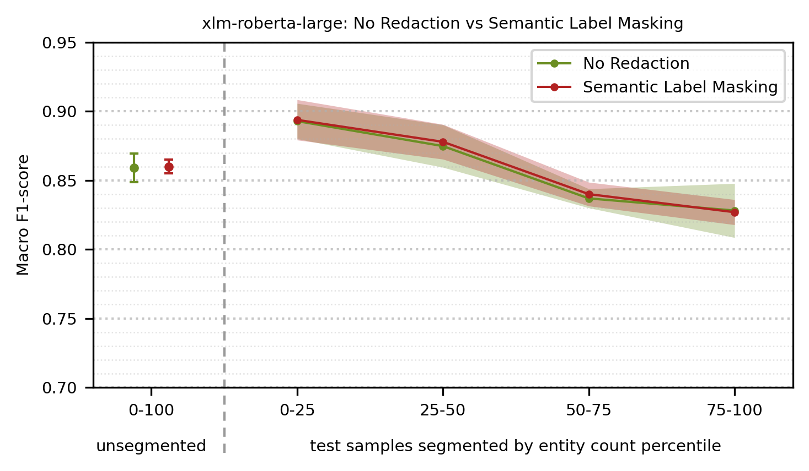
  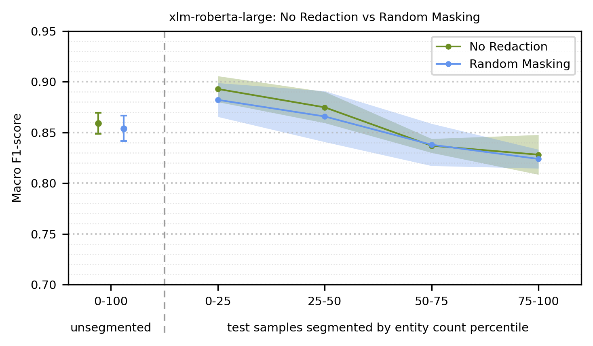
  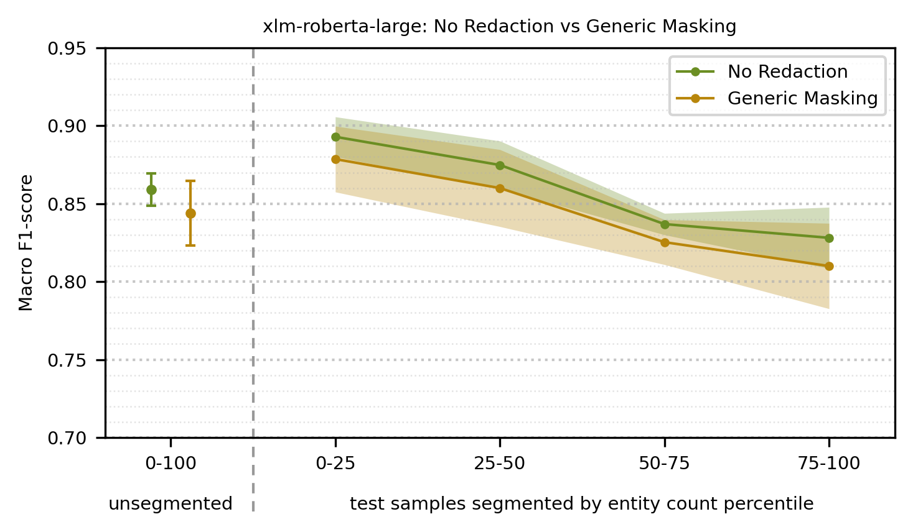
</p>

<br/>

<b>Model</b>: bert-large-cased <br>
<b>Metric</b>: Macro F1-score

| Redaction Strategy     | 0-100           | 0-25            | 25-50           | 50-75           | 75-100          |
|:-----------------------|----------------:|----------------:|----------------:|----------------:|----------------:|
| <i>No Redaction</i>    | <i>0.85 ± 0.01</i> | <i>0.89 ± 0.01</i> | <i>0.87 ± 0.02</i> | <i>0.83 ± 0.02</i> | <i>0.81 ± 0.03</i> |
| Semantic Label Masking | 0.84 ± 0.01 | 0.88 ± 0.02 | 0.86 ± 0.01 | 0.82 ± 0.02 | 0.80 ± 0.03 |
| Random Masking         | <b>0.82 ± 0.02</b> | <b>0.87 ± 0.02</b> | <b>0.84 ± 0.03</b> | <b>0.79 ± 0.03</b> | <b>0.78 ± 0.03</b> |
| Generic Masking        | 0.85 ± 0.01 | 0.89 ± 0.01 | 0.87 ± 0.02 | 0.82 ± 0.02 | 0.81 ± 0.02 |

<p align="left">
  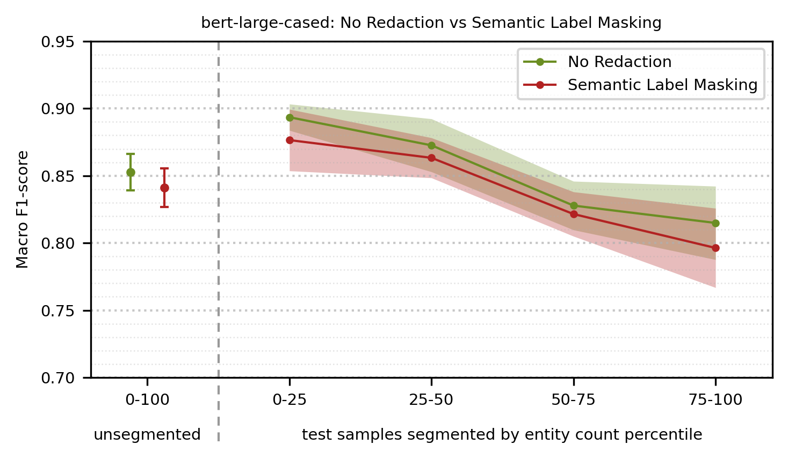
  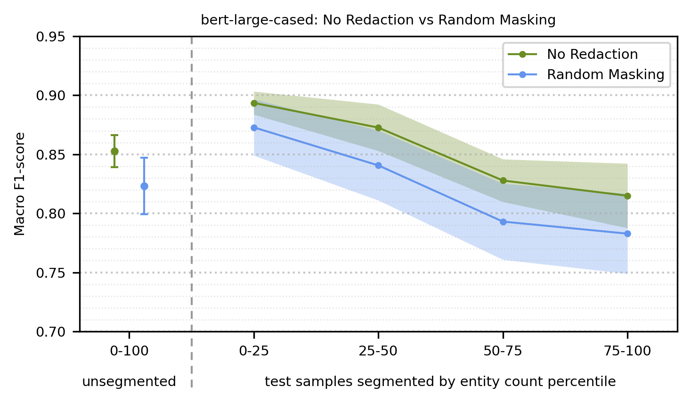
  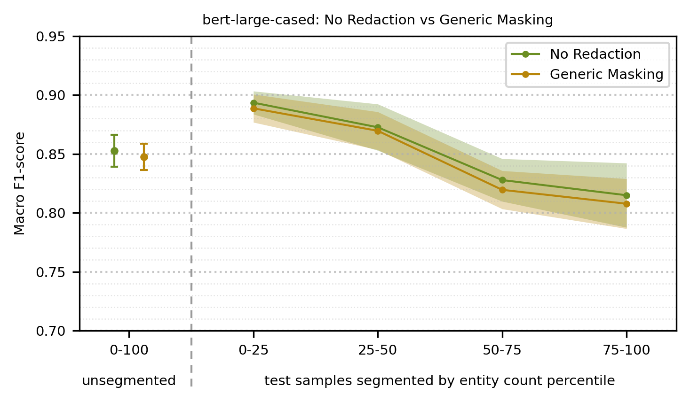
</p>

<br/>

<b>Model</b>: electra-large-discriminator <br>
<b>Metric</b>: Macro F1-score

| Redaction Strategy     | 0-100           | 0-25            | 25-50           | 50-75           | 75-100          |
|:-----------------------|----------------:|----------------:|----------------:|----------------:|----------------:|
| <i>No Redaction</i>    | <i>0.84 ± 0.01</i> | <i>0.88 ± 0.01</i> | <i>0.86 ± 0.02</i> | <i>0.81 ± 0.02</i> | <i>0.80 ± 0.02</i> |
| Semantic Label Masking | <b>0.82 ± 0.02</b> | 0.87 ± 0.02 | 0.85 ± 0.02 | <b>0.78 ± 0.04</b> | <b>0.75 ± 0.03</b> |
| Random Masking         | <b>0.82 ± 0.01</b> | 0.87 ± 0.01 | <b>0.84 ± 0.02</b> | <b>0.79 ± 0.02</b> | <b>0.77 ± 0.02</b> |
| Generic Masking        | <b>0.82 ± 0.02</b> | 0.88 ± 0.01 | 0.85 ± 0.02 | <b>0.78 ± 0.04</b> | <b>0.76 ± 0.02</b> |

<p align="left">
  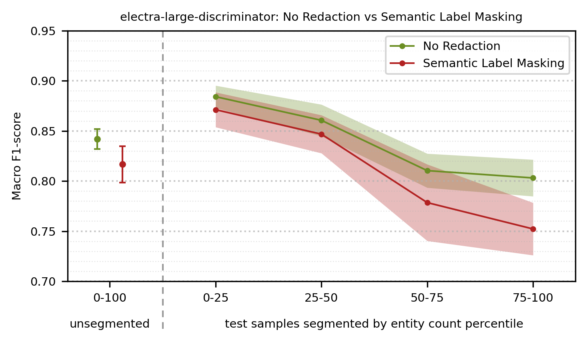
  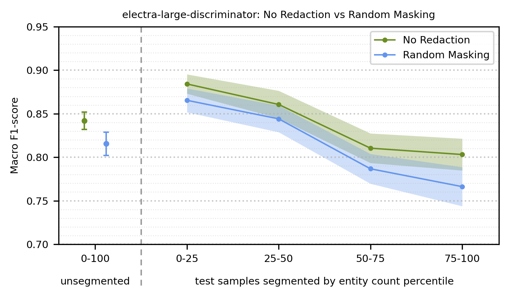
  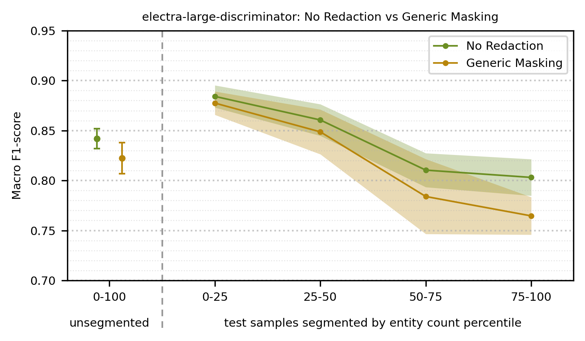
</p>